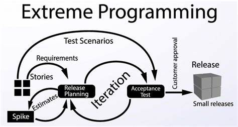

# Answers to the Questions in Readme

## Agile Development

> The Agile Software development lifecycle is a structured series of stages which put togethers helps a team to solve problems easily adapt to turbulent environments and deliver working products on time. The lifecycle of agile software development will vary with respect to the methodologies used. For example, Scrum works in teams with smaller frame of time (Short periods of time), whereas Kanban works continuously without with any relevant distinction of roles.  

## Extreme Programming

> Extreme Programming is an Agile software development method which helps to improve the efficiency of the developers working on the project.  

  
